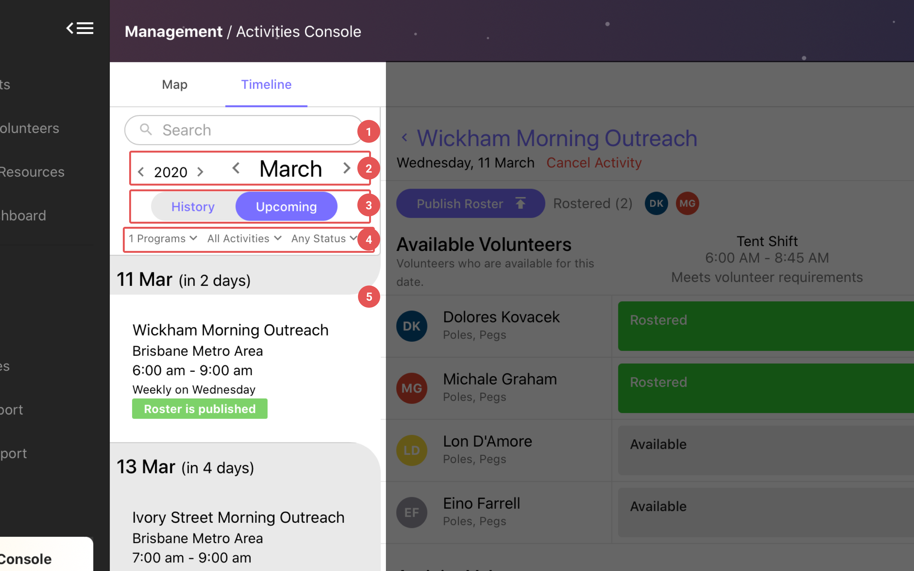
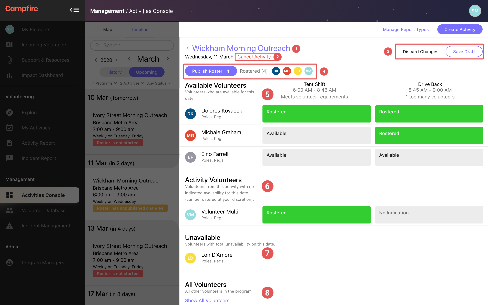

# Introducing Activities
{: .no_toc }

## Table of contents
{: .no_toc .text-delta }

1. TOC
{:toc}

---

## What are Activities?

Activities are our way of connecting volunteers with amazing opportunities. An Activity on Campfire can be anything: a weekly shift, a weekend event, or a standalone speaking engagement or activation. Let's find out how a Activities fit into the structure of your operations.

### Structure and motivation

1. **Organisation** -- Your organisation sits at the very top of your Campfire account. Settings such as your application screening questions, onboarding prerequisite, activity roles, and eventually Report Types all sit at the organisational level.
1. **Program** -- Programs are used to break down your volunteers and activities into manageable pools. Programs might be region based, or structured by the type of operation that they contain, or both! The Program Manager role can be assigned to split the work between your leaders and managers.
1. **Activity** -- The core of Campfire operations, Activities are where volunteers are connected with your mission. Rosters and Reports are all managed through activities; we cover how to use these systems further down the page.
1. **Session** -- Within an Activity there are Sessions. A Session is simply used to distinguish individual units of work. An Activity may have one session, or several.

### Changes to Terminology and Pages

#### Words that have changed

| Old Word        | New Word        | Meaning |
| --------------- | --------------- | ------- |
| Shift           | Activity        | ...     |
| Shift Report    | Activity Report | ...     |
| City            | Program         | ...     |
| Service Manager | Program Manager | ...     |
| Team Leader     | Activity Leader | ...     |

#### Pages that have changed

| Old Page         | New Page         | Why? |
| ---------------- | ---------------- | ---- |
| All Locations    | Explore          | ...  |
| My Shifts        | My Activities    | ...  |
| Shift Report     | Activity Report  | ...  |
| Service Managers | Program Managers | ...  |

#### Pages that have been absorbed by Activities Console

| Pre-Activities Console | Meaning |
| ---------------------- | ------- |
| Completed Shifts       | ...     |
| Roster                 | ...     |
| Team Builder           | ...     |
| Shift Management       | ...     |

## Using the Activities Console

1. **Activities Console Tabs** -- Use these to change views while using the Activities Console. The `Map` view is available on desktop. The `List` view is the mobile equivalent of the map, useful for quickly finding an activity. `Timeline` is a more complex interface, presenting all historic and upcoming Activity dates, allowing you to access any past/present Activity Report or future Roster from a single place.
2. **Management Tools** -- Toolbar for creating/managing Activities and Report Types. As more management tools are added they will appear here (i.e. Program Management `coming soon`).

### Map View

1. **Search Bar** -- Use this to search for any Activity within the current filters
2. **Filters** -- Use the filter settings to show more or fewer Activities. You can apply settings to view Activities across multiple programs, or narrow your search down by day, duration, and time.
3. **List** -- The list of Activities returned by the filter and search settings. Click on any activity to open the `Overview` interface.
4. **Map** -- A map view of the listed Activities.

### Timeline View

1. **Search Bar** -- abc
2. **Date Selection** -- abc
3. **Timeline Switch** -- abc
4. **Filters** -- abc
5. **List** -- abc

> Activities Console Map Screenshot 1

## Rostering with Activities

1. **Activity Name** -- abc
2. **Cancel Activity Button** -- abc
3. **Roster Drafting Tools** -- abc
4. **Roster Publishing Tools** -- abc
5. **Available Volunteers** -- abc
6. **Activity Volunteers** -- abc
7. **Unavailable Volunteers** -- abc
8. **All Volunteers** -- abc

## Submitting Activity Reports

## Activity Overview
