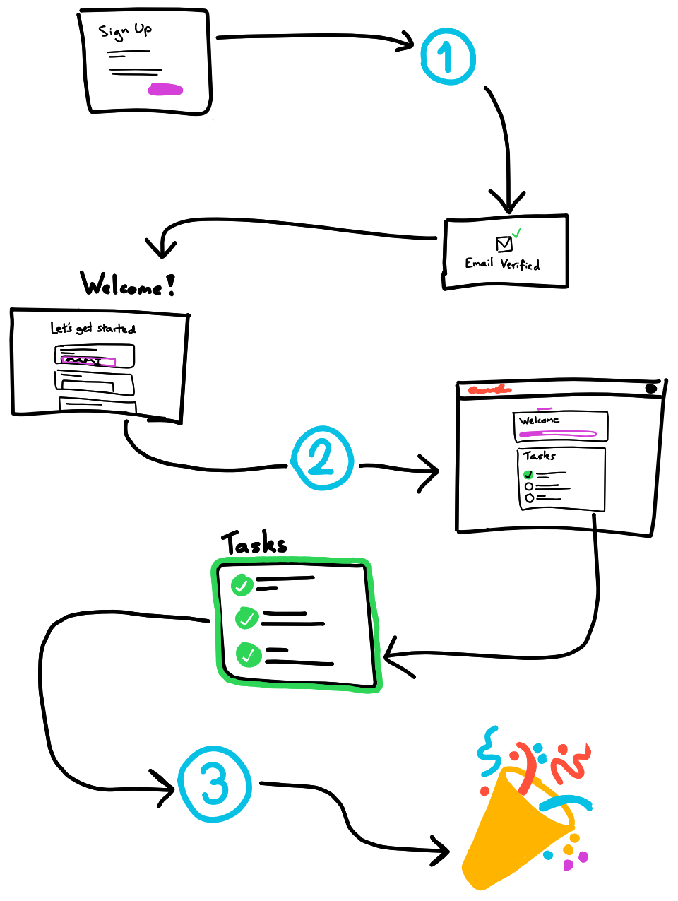
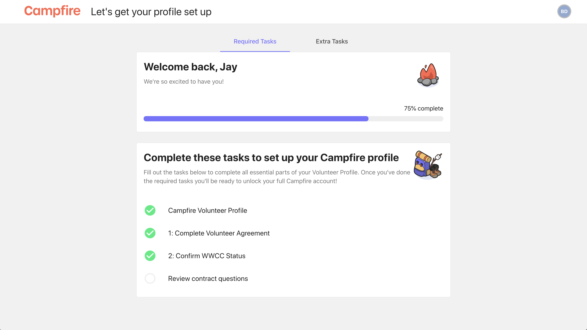

# Campfire's onboarding flow
{: .no_toc }
{: .fs-10 }

We want every new volunteer to feel loved, but boxes need to be ticked before a new legend is ready to join your mission. Campfire gives you a platform to provide your new applicants and volunteers with an effortless onboarding experience that is smooth, simple, and guided, while demanding no ongoing effort or repetitive process from you or your team.

---

## Skip To
{: .no_toc .text-delta }

1. TOC
{:toc}

---

## One step at a time
{: .fs-10 }

To get the most out of Campfire, and give your volunteers the best experience, you'll want to have an understanding of our onboarding flow. We start with a new applicant signing up, move through an email verification, and then enter the 'Set up your profile' stage. The volunteer is onboarded once they have met requirements and have a completed and approved volunteer profile.

Let's walk through each stage;

{: .my-8 }

Campfire's onboarding flow is simple from the volunteer's perspective. There are a few key points in the process that will determine where your manual check-ins, if any, will exist. We have marked these points `1`, `2`, and `3` in the blue circles on the diagram -- let's dig in.

### 1. Application review and Screening Questions

A new volunteer, someone who has come to you (i.e. not an invitee), will always begin with the sign up screen. Your sign up screen is the address that you would link to, and ends in `/apply`. This is where the applicant enters their name and email, and we ask them to choose a password. The email and password that they choose here will be used to sign in from then on.

There are two ways that you can configure this first checkpoint to be a manual review stage; screening questions and auto-approve application. Both of these settings can be found in the Admin Console, under the `Onboarding` panel.

#### Screening Questions

Adding screening questions is an easy way to filter volunteers through broad criteria. Screening questions are simple yes/no questions that can be configured to have a correct (and therefore incorrect) response. If an applicant answers any screening questions incorrectly then they will stop in checkpoint `1` and await review. If you don't want this behaviour you can always set the screen question(s) to accept 'either' response.

#### Auto-approve Application

On the same `Onboarding` panel in the Admin Console, the auto-approve switch is a direct toggle to enable/disable checkpoint `1`. If the switch is on, then the applicant will be automatically passed through and will NOT require any manual review. If the switch is off then every applicant will stop at checkpoint `1` regardless of screening question responses.

### 2. Initial Volunteer Profile

After a volunteer has an approved application, they will have a user account. This is displayed as the `Account Created` status on [Incoming Volunteers](). Every volunteer most complete their initial volunteer profile task before they are able to access the remainder of the required and extra tasks.

Campfire uses this time to capture critical user information to put toward the applicants profile, like a contact number, and date of birth. Most importantly this is the stage that we ask the applicant to select a program, ensuring that your Program Managers can track the applicant as soon as possible.

To activate checkpoint `2` simply locate the **Campfire Volunteer Profile** task on the required tasks page and flick the `Manual Review` switch off. You should see this at the top of the list on the Volunteer Profile page in the Admin Console.

A perfect use for this checkpoint is as an expression of interest form. If you need to review volunteers before allowing them to continue with the other tasks, just build your introductory questions into the **Campfire Volunteer Profile** and turn `Manual Review` off.

### 3. Volunteer Profile completion

With an account created and an initial volunteer profile approved, your applicant is well on their way to having a complete volunteer profile. The volunteer will be able to finish their profile once all required tasks have been submitted and approved. Checkpoint `3` can be activated by the configuring some or all of your required tasks to require `Manual Review`.

{: .my-8 }

It only takes one task with the manual review switch on to activate checkpoint `3`. You can turn it on for all tasks if that makes sense in your setup.

Keep in mind that once any required tasks are manually reviewed, the volunteer profile can be automatically completed if no other manual review tasks remain. If you need to be extremely cautious about manually reviewing volunteers then it's important that you leave at least one task un-approved until the vollie submits everything. Alternatively switching every task to `Manual Review` will ensure that the an incoming volunteer can never have their profile approved automatically.

Let's learn more about how to create tasks so that you can engage with and collect info from your applicants without breaking a sweat.

## Creating a task
{: .fs-10 }

The `Volunteer Profile` panel in the Admin Console is home to onboarding tasks. As an applicant completes these tasks they are tied to their Volunteer Profile, and there they will remain as the volunteer continues their journey beyond onboarding.

To create a new task hit `Add task` at the top-right corner of the panel. You'll be taken to the form builder, where we can give the task some basic details before we start populating it with items.

Give your task a short, unique name. We recommend that you make it descriptive and include an action. Some examples of task names might be;

- Upload resume
- Read our volunteering agreement
- Fill out expression of interest form
- Submit your driver's license details

You can add a short description if you'd like. This will appear next to the name in the list of tasks.

You'll need to select a place to add the task to, and currently you have two options to choose between; required and extra.

### Required tasks vs. Extra tasks

If you need every new volunteer to complete the task, select the `Required` option. If you want to offer volunteers the opportunity to complete the task, but make it non-mandatory select `Extra`.

Volunteers will see the required and extra tasks in the same way that you do in the admin console. Required tasks are listed in the main tab, while extra tasks can be discovered by visiting the secondary tab.

### Manual review

The manual review setting for all of your tasks (besides the **Campfire Volunteer Profile**) is found on this Task Details panel. Switch it on to enforce that this task is always reviewed by a manager or admin before the volunteer profile can be completed.

Check out the [onboarding flow](#campfires-onboarding-flow) discussion above for more detail.

### Headings and instructions

Most of the work on your tasks will be done through using the smaller control panel to the right hand side of the interface. From here you can add headings, instructions, and fields. Each time you add one of these items they will appear in the list below the main title card where you entered the task name.

#### Headings

You can use headings to add structure to your tasks. Headings are ideal for introducing groups of related questions, or separating sections in longer tasks. Click `Add heading` on the control panel and give your heading a name, then hit `Done`. Your heading name should be short and sweet; if you're needing to give a more descriptive message or leave some instructions then we have just the thing for you!

#### Instructions (Soon to be called Messages)

Instructions give you all of the functionality of our rich text editor to be used anywhere that your task needs it. This could be anything ranging from a simple subtitle to complement a `Heading`, to an entire volunteer agreement.

If you need to add links to external websites or shared files, then Instructions has got you covered on that too. Find out more [adding links with the rich editor](https://guide.campfireapp.org/docs/managers/uploading-content-with-resources/#adding-links-using-the-text-editor) from our other guide.

## Deleting Tasks and Fields

Campfire does not currently support moving fields between tasks, or recovering tasks and fields once they're deleted. The delete task and delete field functionality is perfect for experimentation when creating and designing new tasks.

Please be aware that deleting a task or field that has been used by your organisation will result in that information becoming inaccessible. We strongly recommend against removing tasks and fields that are pre-existing and have already been used by volunteers.

<!-- ### Adding fields -->

<!-- Talk briefly about each field type
Optional vs. required fields (note about data integrity)
Recommendations on multi-select vs. checklist vs. dropdown
Aside about attachments
Examples for `If yes then` style questions -->

<!-- ## What the volunteer sees -->

<!-- Side by side comparison of required tasks cakes -->

<!-- ## Keeping track of incoming volunteers -->

<!-- Link to a new incoming volunteers page -->
