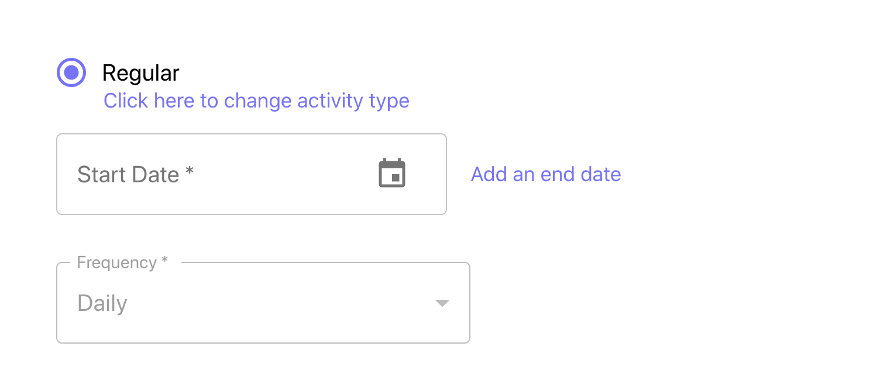
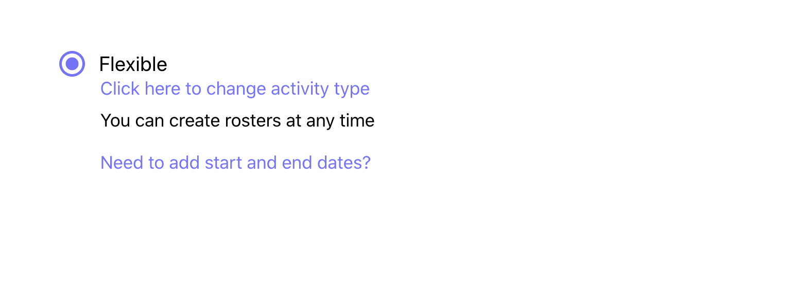
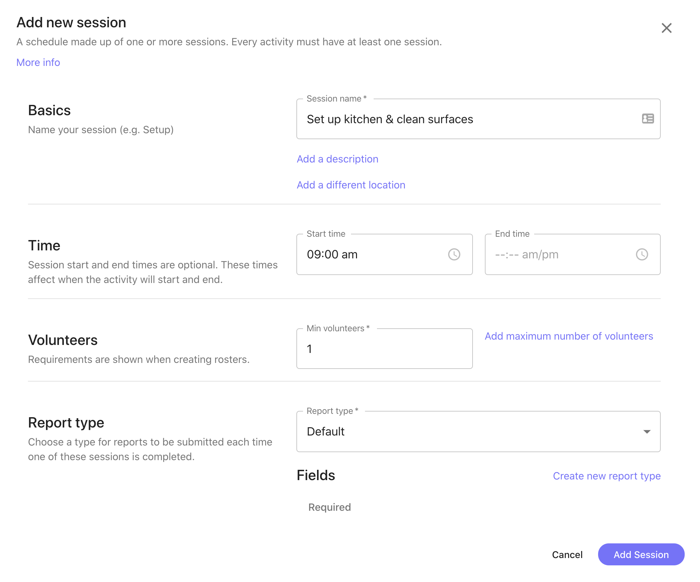

# Creating an activity
{: .no_toc }
{: .fs-10 }

---

## Skip To
{: .no_toc .text-delta }

1. TOC
{:toc}

---

In this guide we’ll show you everything you need to know to create an activity. We’ll begin with the fundamentals, and take you through all of the settings and configurations so that you can create the perfect activity every time.

## What is an activity?
{: .fs-10 }

Activities are Campfire’s way of connecting volunteers with volunteering opportunities. In Campfire, an activity can be almost anything: weekly outreach shifts, monthly catch ups, weekend events, packing events, ad-hoc meetups, and anything in between.

Let's start with the lifecycle of an activity:

1. **You create an activity to describe a volunteering opportunity, set the time frame, and add session(s) to breakdown the work**
1. Volunteers apply and join the team, or are added to the team by managers
1. Volunteers choose their availability for upcoming dates (rosters) and times (sessions)
1. Rosters are published to let people know they’ve been selected for specific dates and times
1. Volunteers attend the activity and do their thing!
1. Reports are submitted to capture volunteer hours and custom impact data from each session
1. Repeat steps 3 to 6 forever, or until the activity time frame is over

This guide focuses heavily on step 1: Creating an activity

<!-- Is there a wrong way to set up an activity?
Short answer: yes, there are right and wrong ways to create activities. We built activities to support all different types of volunteering, so the configuration that you choose each time can vary depending on the situation. It’s important to choose your activity configuration to get the best results. You can read more about activity configurations in our example activities handbook. -->

## Configuring a new activity
{: .fs-10 }

Activities can be customised to suit a range of operating conditions. Let’s learn a little more about the settings you’ll encounter when creating an activity.

**What you’ll need to create an activity:**

- Program Manager or Admin privileges

### Basics

When you first create an activity, we’ll ask you to fill out some basics.

1. Name: Give your activity a unique, memorable name. The name is used to identify the activity and will be the primary title for your activity across all interfaces.
1. Program: Every activity needs to belong to a program. Programs are used to group and separate activities and volunteers across your organisation. Read more about Programs and Campfire’s structure
1. (Optional) Description: Click Add a description to include additional information on the activity. Activity descriptions are visible to all volunteers.

### Privacy settings

Choose the privacy settings for your activity. Consider how you want volunteers to find the activity and join the team.

- Joining policy: You can choose to set the joining policy to open. An open activity will allow volunteers to join the team instantly and start applying for rosters.
- Hide activity: Hide the activity if you want to remove it from volunteers’ view. Hidden activities will only be visible to volunteers who are on the team. Managers can still see all hidden activities through the Activities Console.

### Activity Type

For this section, you’ll need to consider the frequency of your activity. Some activities will be very regular, and recurring, while others might be sporadic or ad-hoc. Choose your activity type, and set the time frame using start and end dates.

**Regular activities** run according to a set frequency and have recurring rosters. They are ideal for repeating activities that use the same structure each time.

1. **Start date**: A start date is required to define the first date that the activity will run.
1. (Optional) **End date**: You can add an end date if you want to define a set time frame for your activity.
1. **Frequency**: Select a frequency for your activity to recur. This recurrence will be based on the start date that you selected.

Frequency options

- Doesn’t repeat: only a single roster and report will be expected on the selected start date
- Daily: rosters and reports will be expected every day between the start and end dates
- Weekly: rosters and reports will be expected once per week, on the day of the selected start date (e.g. Weekly on Thursday)
- Monthly on date: the rosters and reports will fall every month on the same date (e.g. Monthly on the 16th)
- Monthly on day: recurrence will be every month on the same week and day (e.g. Monthly on the third Monday)

Regular activities will generate an empty roster for each day that the frequency setting would expect, between the start and end dates. It’s up to you and your team to ensure that the rosters are used; which means publishing them on the dates the activity will be running, and cancelling them on the days that it doesn’t.

**Flexible activities** do not run according to a set frequency. Rosters will need to be created individually; reports can then be submitted in response to the created rosters. Flexible activities are perfect for things that run irregularly, or for any kind of work that doesn't have a predictable daily, weekly, or monthly frequency.

1. (Optional) **Start and end dates**: Start and end dates are not required here, but can be added if the activity does have a distinct time frame.

### Sessions

Every activity needs at least one session. Sessions give you a way of breaking down an activity into chunks. You can use these chunks to describe sequential shifts, parallel blocks of work, individual start/middle/end reports, and loads more.

Each session is tied to a report type. Report types are the customised sets of questions that include your impact data fields. Breaking an activity into multiple sessions is an easy way to allow different teams to record data over the same period of time, or across the duration of the activity. You can also dedicate sessions to smaller reports and leave a single session at the end of an activity to a larger, final report.

Let’s take a look at what goes into a session.

1. **Session name**: Pick a session name that describes what will be going on. Make each session name unique within the activity, and be sure to choose something that makes sense to you and your volunteers.
1. (Optional) **Description**: You can add a description to include additional info for volunteers who join the activity.
1. (Optional) **Alternative location**: Sessions will default to the activity location (which you choose in the following section), but you can specify a different location on sessions if needed. We cover activity location selection in the next part of this guide.
1. (Optional) **Start and end time**: Most sessions will have a known start time and end time. If the session does not occur at a set time, you can choose to leave these fields blank. The overall activity time will be taken from the earliest start and latest end time across all sessions.
1. **Volunteer numbers**: Indicate the minimum number of volunteers that the roster should expect for each session. You can at a maximum too if appropriate. Currently these numbers are for display only, and do not affect any functionality of the volunteer availability or roster building.
1. **Report type**: A report type is required for each session. You can choose a pre-existing report type from the dropdown. This selection will correspond to the report that your team submits at the end of each session. Consider breaking bigger reports into their own small session if intermediary reports don’t need to collect as much data. Admins can also create new report types at this step.

### Location

Here you describe where your activity is taking place. All of your sessions so far, unless indicated otherwise, will inherit this location.

Use the location field to search for any address. If your activity is online, or doesn’t have any physical location then you can make it a remote activity.

Remote activities can have a link or phone number attached. Remote info is only visible to volunteers who are part of the activity’s team.

### Attachments

Attachments can be added to an activity. You can upload most images, files, or documents by clicking on Attach a File from Your Computer. Attachments are visible to all volunteers.

## What's next?
{: .fs-10 }

[Learn more about rosters](/docs/managers/intro-to-rosters/)