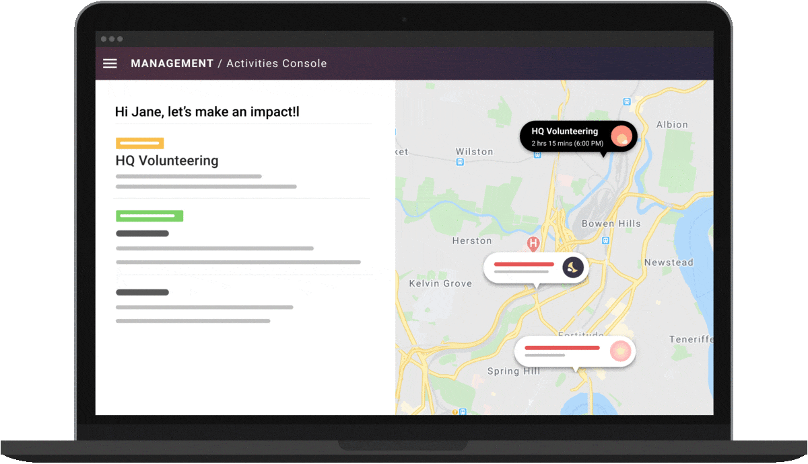

# Intro to rosters
{: .no_toc }
{: .fs-10 }

---

## Skip To
{: .no_toc .text-delta }

1. TOC
{:toc}

---

## What is a roster?
{: .fs-8 }

Rosters are an essential ingredient in every Campfire recipe. Every activity should feature at least one roster at some point. Larger teams can publish more than 30 new rosters every week. Without rosters, your volunteers receive no communication or visibility as to the dates and times that they’re expected to attend activities.

Remembering back to the lifecycle of an activity:

- You create an activity to describe a volunteering opportunity, set the time frame, and add session(s) to breakdown the work
- Volunteers apply and join the team, or are added to the team by managers
- Volunteers choose their availability for upcoming dates (rosters) and times (sessions)
- **Rosters are published to let people know they’ve been selected for specific dates and times**
- Volunteers attend the activity and do their thing!
- Reports are submitted to capture volunteer hours and custom impact data from each session
- Repeat steps 3 to 6 forever, or until the activity time frame is over

## Where do rosters come from?

All rosters begin in an empty state. Empty rosters are marked by a ‘not started’ label. On an empty roster, none of the sessions will have had any volunteers assigned to them, and the roster will not yet have been drafted or published.

### For regular activities

Regular activities will have empty rosters generated for all of the dates prescribed by the frequency that was selected when the activity was created. These rosters won’t be generated beyond the end date if one was chosen. You can create additional rosters for dates other than the ones generated by the activity frequency; we call these instant rosters.

### For flexible activities

Flexible activities, on the other hand, will not generate any empty rosters. You’ll need to create an instant roster for each date that you’ll run the activity. Using instant rosters is not optional when working with flexible activities, so understanding how instant rosters work is crucial to most teams on Campfire.

## What's next?
{: .fs-8 }

[Learn how to create an instant roster](/docs/managers/create-an-instant-roster/)