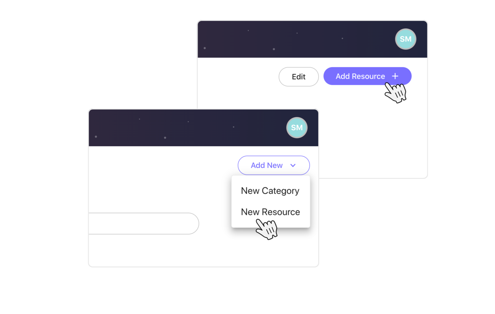
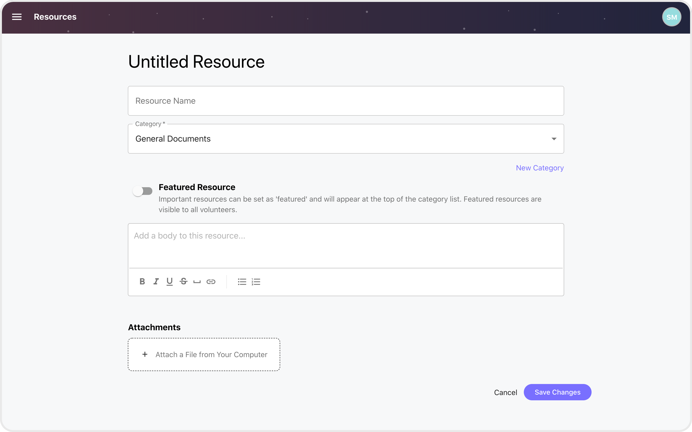
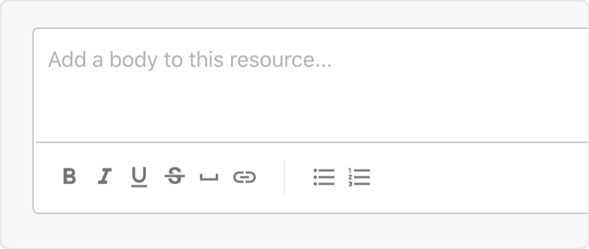
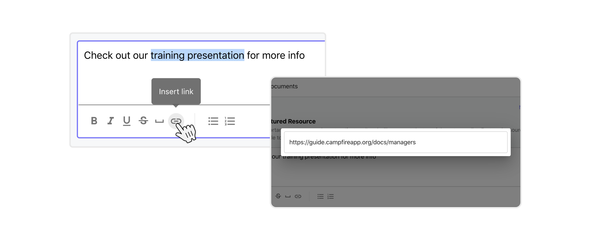
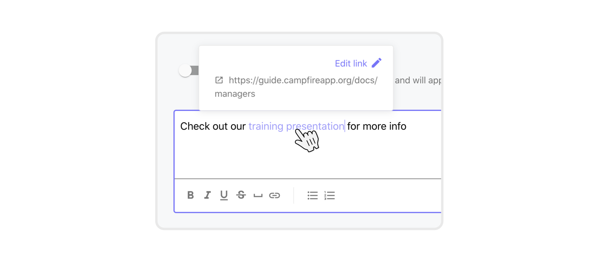
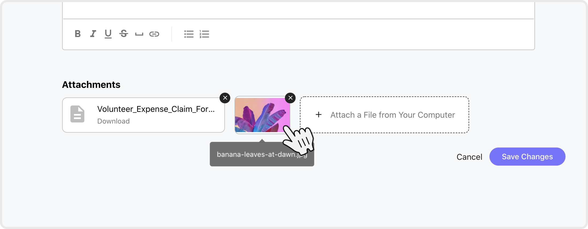

# Uploading your own content with Resources
{: .no_toc }

{: .no_toc .text-delta }

## Table of contents

{:toc}

1. TOC

---

{: .fs-10 }

## Adding a New Resource

### Creating the resource

Creating a new resources is easy, and can be done from several places:

1. On the Resources landing page click `Add New` and choose `New Resource`
2. In a category hit the `Add Resource` button
3. While viewing an existing resource you can also hit `Add Resource` to create a new one in the same category

With your new resource created, you'll be looking at the resource editor. Once you've chosen name, and a category for the resource to live in, you'll be ready to add some content. You can create a new category for the resource at this step too.

{: .my-8 }

### Formatting and styling with the text editor

The resource editor includes an easy to use rich text editor for you to put content in. This area can be left blank if you don't have anything to say, but it's always nice to leave a message or description. If you want to get serious about structure you can do that too!

{: .my-8 }

Our text editor includes, from left to right, **Bold**, _Italic_, Underline, ~~Strikethrough~~, and `Monospace` formatting. You can apply any of these formats to normal text by either selecting the style and then typing, or by highlighting a section of text then choosing the style (or styles!) that you want. Hit the button again when you're done to switch the style off.

The Bulleted List and Numbered List are available too, simply choose the one that you want and use Enter/return on your keyboard to add new items. Once you're finished just hit the button again to end the list, or Enter/return again.

### Adding links using the text editor

Next to the basic style options, but before the list formatting options, is the link feature. Highlight any word and hit the Insert link icon to open the URL dialog. Type or paste a URL into the dialog, then click any where to close it. Voila!

Editing links is easy, simply hover the link until the preview opens, then click `Edit link`. You can also click on the link in this preview to test that it works as expected.

### Uploading files as attachments

To add files to your resource look no further than the Attachments section. You can add files one of two ways:

1. Hit the `Attach a File from Your Computer` button and select one or more valid files.
2. `Drag & Drop` any valid file or files from your computer into the attachments section.

You can add as many files as you like, but don't go overboard with the file size! Resources support files of up to **10MB** each in size, so it's ideal for PDF documents and images. If you have any larger files such as videos or PowerPoints, then it's better to upload these elsewhere and add a link to them using the [text editor](#Formatting-and-styling-with-the-text-editor).

{: .my-8 }

### Featured Resources

Featured resources appear above others in the list, and are marked with a golden star. You can switch the featured option on/off a resource at any time by editing it.

{: .fs-10 }

## Category and Resource Structure

Categories are folders for resources. The landing page will show up to 5 resources from each category, with featured resources being given priority over other recently created resources. You can click on the category name to open the category and see all resources. If a category contains more than 5 resources it will also show the `View all items` button below.

### Renaming a category

You can edit categories at any time if their name needs to be changed. Look for the `Edit Category` buttons in various places.

### Moving resources between categories

A resource can only exist in one category at a time. To move a resource to a different category simply edit that resource and use the dropdown to pick the new category, then hit save.

{: .fs-10 }

## Updating Resources

Add or update content at any time by editing the resource. To access the resource editor open the resource and click the `Edit` button at the top-right of the screen.

You can change the name, category, text, and add or remove attachments. If you make a mistake and want to throw away your changes scroll down and hit `Cancel`. Otherwise hit `Save Changes` once you're happy with your edited resource.

The resource editor is also where you can add or remove the resource from Featured Resources by using the aptly named switch.

{: .fs-10 }

## Deleting Resources

There are two places you can go if you need to delete a resource:

1. Open the resource directly and click `Edit`, then scroll to the bottom and choose `Delete this resource`
2. Edit the resource's category and use the `Delete Resource` (red X) button to remove it, then hit `Save Category` to delete all resources that were removed - if you make a mistake here you can click `Cancel` to discard your changes.

{: .fs-10 }

## Deleting a Category

If you need to delete a category the `Delete this Category` button can be found at the bottom of the page when editing a category. This process will result in all resources contained within the category being deleted too, so be sure to [move any resources](#Moving-resources-between-categories) beforehand if you don't want to lose them.
